# Developer Onboarding Guide

Welcome to the Toggl CLI project! This guide will get you from zero to productive contributor in under 30 minutes.

## 🚀 Quick Start (5 minutes)

### Prerequisites
- Node.js 18+ installed
- Yarn package manager
- Git configured
- Basic TypeScript knowledge

### Get Running
```bash
# Clone and setup
git clone https://github.com/toddhainsworth/tog.git
cd tog
yarn install && yarn build

# Test your setup
./bin/run.js --version
./bin/run.js --help

# Make your first change
# Edit src/commands/ping.ts - change the success message
yarn build && ./bin/run.js ping
```

**🎉 Success!** You've built and run the CLI. Ready for more?

## 🏗️ Architecture Overview (15 minutes)

### Project Structure
```
src/
├── commands/          # One file per CLI command
│   ├── start.ts      # Interactive timer start
│   ├── week.ts       # Weekly reports
│   └── ...
├── utils/            # Shared utilities
│   ├── time.ts       # Date/time functions
│   ├── api.ts        # Toggl API client
│   └── ...
├── config/           # Configuration management
│   └── validation.ts # Type-safe config schema
└── cli.ts           # Main entry point
```

### Key Principles
- **🎯 Single-file commands** - Everything for a command in one file
- **🛡️ Type safety** - Zero `any` types, comprehensive validation
- **⚡ Performance** - Sub-second builds, instant CLI responses
- **🔧 Maintainability** - Clear patterns, excellent documentation

### Command Anatomy
Every command follows this pattern:

```typescript
// src/commands/example.ts
import { Command } from 'commander';
import { loadConfig } from '../config/index.js';
import { createTogglClient } from '../utils/api.js';

export function createExampleCommand(): Command {
  return new Command('example')
    .description('Example command description')
    .option('-f, --flag', 'Example flag')
    .action(async (options) => {
      try {
        const config = await loadConfig();
        const client = createTogglClient(config.apiToken);

        // Command logic here
        console.log('✅ Success!');
      } catch (error) {
        console.error('❌ Error:', error.message);
        process.exit(1);
      }
    });
}
```

### Architecture Diagram


### Data Flow

```mermaid
sequenceDiagram
    participant User
    participant CLI
    participant Config
    participant API
    participant Toggl

    User->>CLI: tog start
    CLI->>Config: loadConfig()
    Config-->>CLI: {apiToken, workspaceId}
    CLI->>API: createTogglClient(token)
    CLI->>API: getProjects(workspaceId)
    API->>Toggl: GET /workspaces/{id}/projects
    Toggl-->>API: projects data
    API-->>CLI: formatted projects
    CLI->>User: interactive prompt
    User->>CLI: select project
    CLI->>API: createTimeEntry(data)
    API->>Toggl: POST /workspaces/{id}/time_entries
    Toggl-->>API: created entry
    API-->>CLI: success
    CLI->>User: ✅ Timer started!
```



### Technology Stack
- **[Commander.js](https://github.com/tj/commander.js)** - CLI framework (lightweight, flexible)
- **[TypeScript](https://www.typescriptlang.org/)** - Type safety and developer experience
- **[ArkType](https://arktype.io/)** - Runtime validation with perfect TypeScript integration
- **[@inquirer/prompts](https://github.com/SBoudrias/Inquirer.js/)** - Interactive prompts
- **[Axios](https://axios-http.com/)** - HTTP client for Toggl API with intelligent caching
- **[Day.js](https://day.js.org/)** - Lightweight date manipulation

## 🔨 Your First Contribution (30 minutes)

Let's add a new command together. We'll create a `status` command that shows current user info.

### Step 1: Create the Command File
```bash
# Create the new command file
touch src/commands/status.ts
```

Add this content:
```typescript
// src/commands/status.ts
import { Command } from 'commander';
import { loadConfig } from '../config/index.js';
import { createTogglClient } from '../utils/api.js';

export function createStatusCommand(): Command {
  return new Command('status')
    .description('Show current user status and workspace info')
    .action(async () => {
      try {
        const config = await loadConfig();
        const client = createTogglClient(config.apiToken);

        console.log('📊 Fetching status...');

        // Get user info
        const user = await client.getCurrentUser();
        const workspace = await client.getWorkspace(config.workspaceId);

        console.log('\n✅ User Status:');
        console.log(`👤 Name: ${user.fullname}`);
        console.log(`📧 Email: ${user.email}`);
        console.log(`🏢 Workspace: ${workspace.name}`);
        console.log(`🕐 Timezone: ${user.timezone || 'Not set'}`);

      } catch (error) {
        console.error('❌ Failed to fetch status:', error.message);
        process.exit(1);
      }
    });
}
```

### Step 2: Register the Command
Edit `src/cli.ts` to add your command:

```typescript
// Add import at the top
import { createStatusCommand } from './commands/status.js';

// Add command registration (find the section with other commands)
program.addCommand(createStatusCommand());
```

### Step 3: Test Your Command
```bash
# Build and test
yarn build
./bin/run.js status --help
./bin/run.js status  # (requires valid config)
```

### Step 4: Add API Methods (if needed)
If the API client doesn't have the methods you need, add them to `src/utils/api.ts`:

```typescript
// Example: Add getCurrentUser method
async getCurrentUser(): Promise<TogglUser> {
  const response = await this.client.get('/me');
  return response.data;
}
```

### Step 5: Add Type Definitions
Create types in `src/types/` if needed:

```typescript
// src/types/user.ts
export interface TogglUser {
  id: number;
  email: string;
  fullname: string;
  timezone?: string;
}
```

**🎉 Congratulations!** You've added a complete new command. This follows the exact pattern used throughout the codebase.

## 🧪 Testing Your Changes

### Development Workflow
```bash
# Development cycle
yarn build        # Compile TypeScript (~1s)
./bin/run.js cmd  # Test your command

# Quality checks
yarn test         # Run tests (<2s)
yarn verify       # Full quality check (~5s)
```

### Manual Testing Checklist
When testing commands:
- ✅ Command shows in `./bin/run.js --help`
- ✅ Help text displays correctly: `./bin/run.js cmd --help`
- ✅ Success case works as expected
- ✅ Error handling works (invalid config, network errors)
- ✅ Interactive prompts work (if applicable)

### Performance Targets
- **Build time**: <1s ✅ (currently ~1s)
- **Test time**: <2s ✅ (currently <2s)
- **CLI startup**: <100ms ✅
- **Commands**: Instant response with loading indicators

## 🎯 Common Development Patterns

### Error Handling Pattern
```typescript
try {
  const config = await loadConfig();
  // ... command logic
  console.log('✅ Success message');
} catch (error) {
  if (error.message.includes('No configuration found')) {
    console.error('❌ Please run `tog init` first to set up your API token');
  } else {
    console.error('❌ Error:', error.message);
  }
  process.exit(1);
}
```

### API Client Pattern
```typescript
const client = createTogglClient(config.apiToken);

// With loading indicator
console.log('📊 Loading...');
const data = await client.getProjects(config.workspaceId);
console.log(`✅ Found ${data.length} projects`);
```

### Interactive Prompts Pattern
```typescript
import { select, confirm } from '@inquirer/prompts';

// Selection prompt
const choice = await select({
  message: 'Choose a project:',
  choices: projects.map(p => ({ name: p.name, value: p.id }))
});

// Confirmation prompt
const confirmed = await confirm({
  message: 'Are you sure?',
  default: false
});
```

### Date/Time Handling Pattern
```typescript
import { getCurrentWeekDateRange, formatDuration } from '../utils/time.js';

// Get current week
const { start, end } = getCurrentWeekDateRange();

// Format duration (seconds to human readable)
const formatted = formatDuration(3665); // "1h 1m 5s"
```

## 🔧 Development Environment Setup

### VS Code Configuration
Recommended extensions:
- TypeScript Importer
- ESLint (when configured)
- GitLens
- Error Lens

### Git Workflow
```bash
# Feature branch
git checkout -b feature/new-command

# Regular commits
git add src/commands/status.ts src/cli.ts
git commit -m "feat: add status command to show user info"

# Push and create PR
git push origin feature/new-command
gh pr create --title "Add status command" --body "Adds user status display"
```

### Debugging Tips
```bash
# Debug API calls
DEBUG=axios ./bin/run.js command

# TypeScript compilation issues
yarn build --watch

# Test specific functionality
./bin/run.js command --help
```

## 📚 Learning Resources

### Architecture Deep Dive
- **[Code Cookbook](COOKBOOK.md)** - 20+ working examples
- **[Troubleshooting Guide](TROUBLESHOOTING.md)** - Common issues and solutions

### External Documentation
- [Commander.js Guide](https://github.com/tj/commander.js#readme)
- [Toggl API Documentation](https://developers.track.toggl.com/)
- [TypeScript Handbook](https://www.typescriptlang.org/docs/)
- [ArkType Documentation](https://arktype.io/docs)

### Code Examples
Look at existing commands for patterns:
- **Simple command**: `src/commands/ping.ts`
- **API integration**: `src/commands/projects.ts`
- **Interactive prompts**: `src/commands/start.ts`
- **Data processing**: `src/commands/week.ts`

## 🚧 Troubleshooting

### Common Issues

**Build fails with TypeScript errors**
```bash
yarn build
# Fix any type errors shown
```

**Command not found in help**
- Check `src/cli.ts` includes your command import and registration
- Ensure `yarn build` completed successfully

**API errors**
- Verify your API token in `~/.togrc`
- Check Toggl API status
- Use `DEBUG=axios` for detailed HTTP logs

**Tests failing**
```bash
yarn test --verbose
# Look for specific test failures and fix
```

### Getting Help
1. Check existing commands for patterns
2. Read error messages carefully
3. Use our [Troubleshooting Guide](TROUBLESHOOTING.md)
4. Search GitHub issues for similar problems
5. Create an issue with detailed reproduction steps

## 🎉 Next Steps

After completing this guide, you can:

1. **Browse the [Code Cookbook](COOKBOOK.md)** for specific implementation patterns
2. **Check GitHub issues** labeled `good first issue`
3. **Propose new features** by creating issues with your ideas
4. **Improve documentation** - this guide included!

### Contribution Ideas
- Add new commands for Toggl features
- Improve error messages and user experience
- Add configuration options
- Enhance reports and data visualization
- Optimize performance

**Welcome to the team!** 🚀 You're now ready to contribute meaningfully to the Toggl CLI project.

---

**Questions?** Check our [Troubleshooting Guide](TROUBLESHOOTING.md) or create an issue.